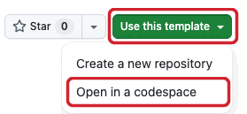
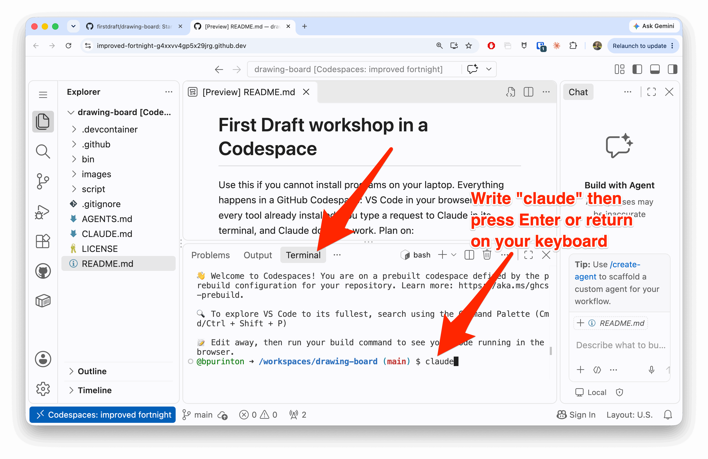
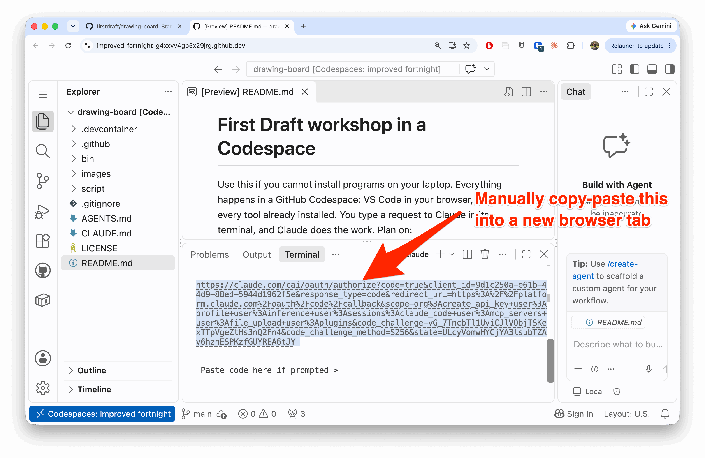
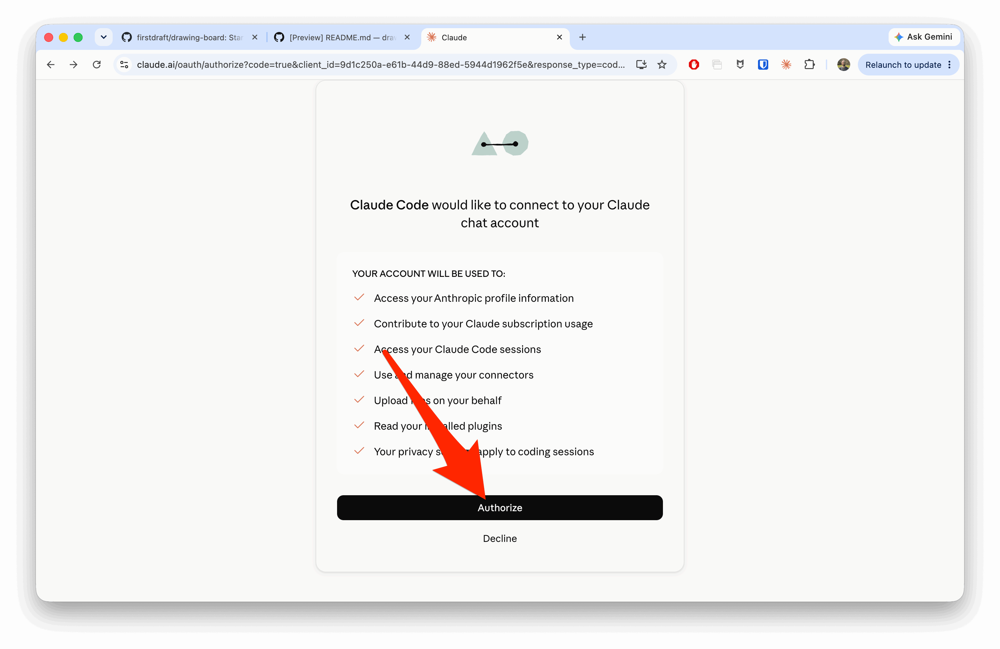
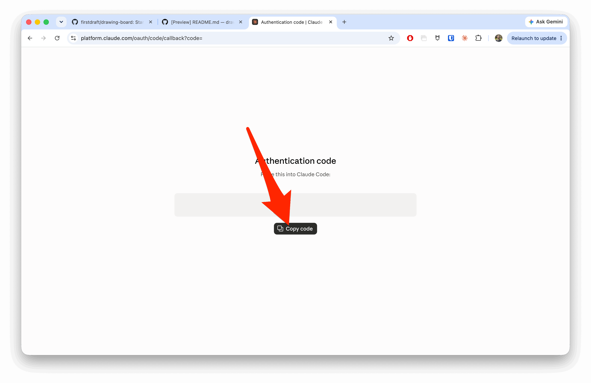
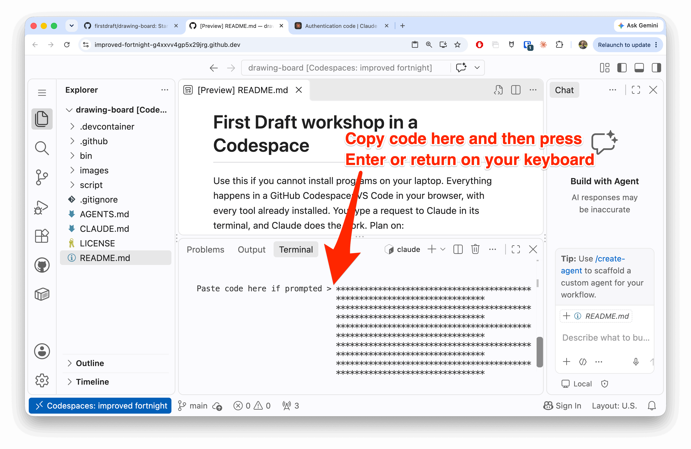
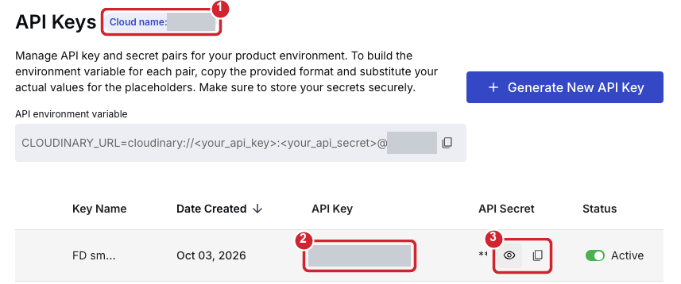
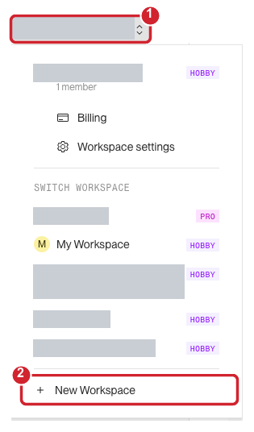

# First Draft workshop in a Codespace

Use this if you cannot install programs on your laptop. Everything happens in a GitHub Codespace: VS Code in your
browser, with every tool already installed. You type a request to Claude in its terminal, and Claude does the work.

Plan on:

- **Setting up your Codespace:** about 5 minutes.
- **Signing in to your accounts:** about 20 minutes.
- **Building, launching and previewing your app:** about 45 minutes, or longer for a bigger idea.

You need a personal GitHub account and a Claude account that includes Claude Code. To use Codex instead, see
[Using Codex](#using-codex).

## Part 1: Set up your Codespace

1. Sign in to GitHub, open [firstdraft/drawing-board](https://github.com/firstdraft/drawing-board), and choose
   **Use this template** &rarr; **Open in a codespace**.

   
2. If VS Code asks, choose **Trust Folder & Continue**. Wait until the terminal at the bottom says
   `Drawing Board setup complete.`
3. Click in the terminal, type `claude` and press Enter. If the terminal shows no `$` prompt, first open a new one
   from the &#9776; menu: **Terminal** &rarr; **New Terminal**.

   

   Claude first asks you to choose a theme (dark or light), not to sign in. Press **Return** to accept the
   default. If it asks anything else before showing a link, press **Return** again.

   Then sign in with your Claude account. Claude shows a long link in the terminal: select all of it, copy it, and
   paste it into a new browser tab.

   Claude may also open a sign-in tab by itself. Close that tab without clicking anything: in a Codespace it ends
   at "This site can't be reached". If you already clicked **Authorize** there, just use the terminal's link now.

   

   Click **Authorize**.

   

   Click **Copy code**.

   

   Go back to the Codespace tab, paste the code into the terminal after `Paste code here if prompted >`, and press
   Enter. The code shows as stars. If pasting does nothing, press `Ctrl+C`, run `claude auth login`, and then
   `claude` again.

   

## Part 2: Sign in to your accounts

When you first try to sign in to First Draft, you'll hit a username/password wall. Ask your instructor for that.

4. Type `/workshop-signin` and press Enter. Claude signs you in to the services your app uses, **one at a time, in
   the order below**. For each one, Claude opens its page in a new browser tab and shows you any code; if VS Code
   asks whether to open the website, choose **Open**. Sign up or approve there, then come back and tell Claude
   you're done. **Wait for Claude to ask before you start the next one.**
   - **GitHub** stores your app's code. You're already signed in; Claude only sets the name and email on your
     commits.
   - **Render** puts your app on the internet.
   - **Neon** runs your app's database on the internet. If the page after you approve says "This site can't be
     reached", tell Claude. You then make a Neon API key and paste it into a private file, the same way as
     Cloudinary below.
   - **Cloudinary** stores the photos people upload to your app. Claude opens a private file in the editor. You copy the three
     values shown below from Cloudinary's website into it, one after each `=`, and save it (`Ctrl+S`, or `Cmd+S` on
     a Mac); Claude saves them without showing them. Before it shows the API Secret, Cloudinary may ask for your
     password or a code it emails you.

     
   - **Revyl** shows your iPhone and Android app on a phone in your browser.
   - **First Draft** plans and builds your app. This is where the username and password wall appears: ask your
     instructor.

   When Claude says you're all signed in, go on to Part 3.

## Part 3: Build your app

Build your own idea. No idea yet? Step 6 has a family social network you can build instead.

5. Bring what you have. Drag any materials for your idea from your computer onto the Explorer on the left side of VS
   Code, into the top folder: wireframes, Figma or Claude Design exports, photos of hand-drawn sketches, or sample
   data as CSV files. Use sample or anonymized data, not real people's information.
   - **Already built a version in Lovable?** On its GitHub repository, choose **Code** &rarr; **Download ZIP**, drag
     the ZIP into the Explorer, and ask Claude to unzip it into a folder named `lovable`. Don't `git clone` it here:
     Claude saves your new app with Git, and could push it to your Lovable repository.
   - **Designed it in Claude Design?** Choose **Export** &rarr; **Hand off to Claude Code** there, and keep what it
     gives you for step 6.

   When Claude builds your app, it moves these materials into `.firstdraft/design`.
6. Type `/clear` for a fresh conversation, then describe your idea in a sentence or two:
   ```text
   /create-full-stack-app A place for my book club to pick the next book and vote on meeting dates. Read the materials in this folder first.
   ```
   Leave out the last sentence if you didn't bring any materials, and paste a Claude Design handoff after your
   idea. No idea yet? Type this instead:
   ```text
   /create-full-stack-app Help me build a social network for just my family. It should work and look like Instagram so that it's familiar.
   ```
7. Claude first looks up how similar apps work, then asks a few questions, one at a time. One of them is how
   involved you want to be in technical decisions. Answer in your own words, or say "you pick". At any point you can
   say "make the rest of the decisions for me".
8. A few minutes in, Claude tells you what First Draft will and won't build. If it can build only part of your
   idea, that's expected: continue with what it builds, or switch to the family social network from step 6. Then
   Claude shows you a summary of the plan. Change anything you like: it's your app. When it looks right, approve
   it. Building takes about a minute.
9. Start the web app:
   ```text
   Start the web app.
   ```
   Claude opens your app in a new browser tab. If your app has sign-in, use the demo login Claude shows you. Try
   each thing your app lets people do.
10. Save your work to GitHub:
    ```text
    Commit the app and push it to a new private repository on my GitHub account. Give me the link.
    ```
    Pushing also starts GitHub building your iPhone and Android apps. That takes about five minutes, so carry on.
11. Put your app on the internet:
    ```text
    Deploy this app to Render's free plan with a Neon database. Give me the link when it's live.
    ```
    Claude will ask you to create a Render workspace for this app first, so each app gets its own free hours.
    The first deploy takes a few minutes. Your live app starts with no data: the sample data is only in your
    Codespace. Sign up on the live app to try it: you are signed in right away. "Forgot password" emails are not
    sent until an email provider is set up.

    
12. Try your app on a phone, in your browser:
    ```text
    Show me the Android app in Revyl.
    ```
    Then:
    ```text
    Now show me the iPhone app.
    ```
    The link opens a phone in your browser. If Revyl asks you to sign in, use the same account as before. Inside
    your app, sign in with the same demo login as in your Codespace. While the phone preview runs, your Codespace's
    web app is public so the phone can reach it; Claude makes it private again when you are done.
13. Make it yours. Ask for one change at a time, then try it in your Codespace. Some ideas, with the examples
    swapped for your own:
    ```text
    Style it similar to Airbnb.
    ```
    ```text
    Limit how many posts each person can create to 50.
    ```
    ```text
    Only allow sign-ups from @MYCOMPANY.com email addresses.
    ```
    When you like a change, say `Commit and push.` Render updates the live app a minute or two later.

## Part 4: Try another idea

Each Codespace holds one app and saves it to one GitHub repository, so another idea gets a new Codespace.

14. Repeat Part 1 to open a new Codespace from [firstdraft/drawing-board](https://github.com/firstdraft/drawing-board).
15. Type `/workshop-signin` again. Your accounts already exist, so each sign-in only needs your approval. Paste your
    Cloudinary values (and Neon key, if you made one) again: each Codespace keeps its own copy.
16. Repeat steps 5 to 13 in the new Codespace.

## If something goes wrong

- **The page stopped loading:** type `Restart the web app.`
- **Claude seems stuck:** press `Esc`, then type `continue`.
- **Building seems stuck for more than five minutes:** type `Cancel the stuck compile and try again.`
- **Claude asks you to approve something:** it checks before risky steps, such as deploying. Approve it if it is
  what you asked for.
- **The Codespace stopped or you closed its tab:** open [your codespaces](https://github.com/codespaces) and choose
  the same one, not a new one. In its terminal, type `claude --continue` to pick up where you left off.
- **The same step fails twice:** raise your hand, and leave the error on screen for the instructor.

## After the workshop

- To come back to a project, open [your codespaces](https://github.com/codespaces), choose its Codespace, and type
  `claude --continue` in the terminal. Your sign-ins stay while the Codespace exists.
- A Codespace stops after 30 minutes without use, and GitHub deletes a stopped Codespace after 30 days. Your app
  is safe on GitHub once you have pushed it. Delete Codespaces you no longer need: free GitHub accounts include a
  limited amount of Codespaces use each month.
- Render's free plan sleeps when nobody visits, so the first visit afterwards takes about a minute.
- To remove an app from the internet, ask Claude: `Delete this app's Render service and its Neon project.`

## Using Codex

Codex is also installed. In step 3, run `codex login --device-auth`: open the link it shows, sign in to ChatGPT,
and enter the code from the terminal. Then run `codex`. Type `$workshop-signin` instead of `/workshop-signin`,
`/new` instead of `/clear`, and `$firstdraft:create-full-stack-app` instead of `/create-full-stack-app`. Everything
else is the same; to pick up later, run `codex resume`.

Maintaining this template? Read the [maintainer guide](https://github.com/firstdraft/dockerfiles/blob/main/drawing-board/README.md).
